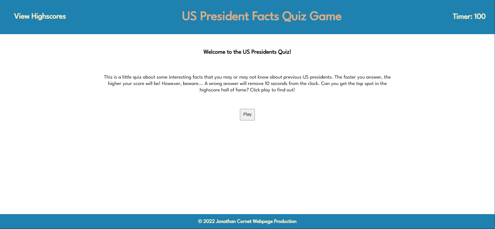
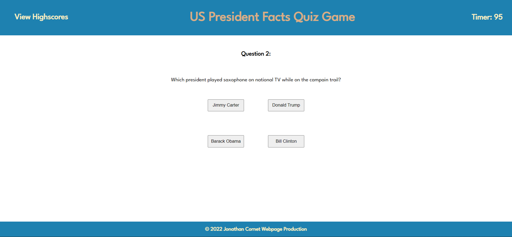
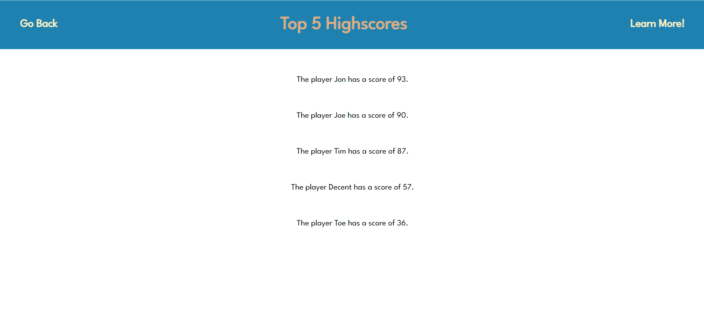

# US President Quiz Game


## Description

This challenge involves creating a quiz game that helps the users test their knowledge about US presidents. Their score is determined by the time it takes to complete the quiz, and scores are stored in local storage. This allows a highscores page to be generated if the quiz is played multiple times. The following User Story and Acceptance Criteria is also met:

## User Story

```
AS A coding boot camp student
I WANT to take a timed quiz on JavaScript fundamentals that stores high scores
SO THAT I can gauge my progress compared to my peers
```

## Acceptance Criteria

```
GIVEN I am taking a code quiz
WHEN I click the start button
THEN a timer starts and I am presented with a question
WHEN I answer a question
THEN I am presented with another question
WHEN I answer a question incorrectly
THEN time is subtracted from the clock
WHEN all questions are answered or the timer reaches 0
THEN the game is over
WHEN the game is over
THEN I can save my initials and my score
```

The webpage looks as following:

## Initial page


## Example of a quiz question


## Highscore page


## Installation

No Installation is needed to view and use this webpage.

## Usage

In order to access the website, visit:

https://cornetj13.github.io/coding-questions-quiz-game/

## Credits

This project was designed by the UW fullstack bootcamp and was fully implemented by me. I referenced W3 Schools for JavaScript methods and functionality:

https://www.w3schools.com/

## License

Please refer to the LICENSE in the repo.